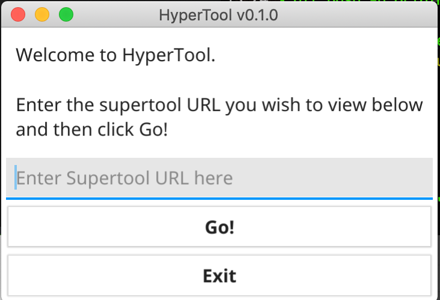
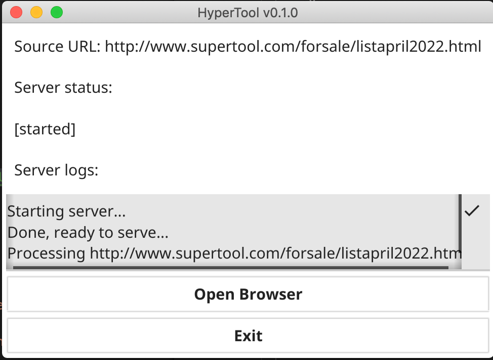

# Hypertool

We all love Patrick Leach, and the services he provides the woodworking and tool collecting community.

This tool just serves to provide a viewer with a more nicely formatted representation of his monthly tool FS posts.

**Patrick Leach pays for his bandwidth out of pocket, so please do not abuse reloading the generated page since it loads all of the images in-line from his host.**

# Supported Builds
I'm currently providing builds for:

* Mac AMD64
* Linux AMD64
* Windows AMD64 (support iffy, build broken for me)

I'm not planning on supporting much else on releases.

Unzip and run!

# History of the project

A long time ago I wrote a chrome plugin that rewrote the SuperTool monthly page inline to add the images, however the lack of TLS and proper server configuration prevents this and javascript solutions (github hosted) now.

This project is a new iteration of that for local use. I wish I could set up a rehost of the images backed by a CDN to lower Patrick's bandwidth usage, however that's difficult these days due to web security.

Patrick if you somehow see this, I'd love to help you set up a free CDN to reduce your hosting costs for these static images so you can use `` tags instead of links :)

# Application

# TODO

* Local database cache of every page fetched (including images) to reduce hits to patrick's site to one fetch per user. Would store image data in an embedded DB for re-use and local serving.
* Improve UI/UX

# Building
This is only relevant to people who want to compile.

This project is x-compilable, however to compile you have some requirements.

* darwin
    * requires o32-clang (provided by osxcross, macOS sdk/devtools)
* windows
    * requires mingw-w64 (homebrew on mac)
* linux
    * requires gcc or musl-cross. requires x11 or mesa headers